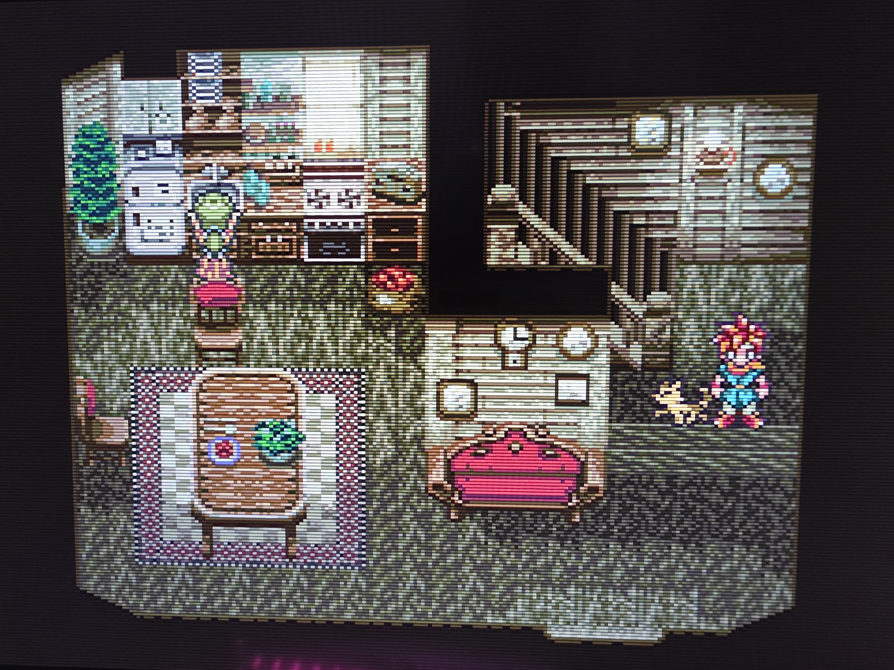

# BigBox Trans-Generational Emulation Station

Welcome to the BigBox Trans-Generational Emulation Station, a project that unifies 40+ years of gaming—from 1980s arcade classics to modern Switch and Steam titles—into a console-like experience on Windows 10. This setup delivers pixel-perfect native resolutions (224p–720p) via HDMI to a compatible modern scaler, providing a gamepad-only interface, and standardized controls across everything. It supports horizontal and vertical (TATE) arcade games, running on any capable PC.

## About
This repository contains detailed documentation for building and configuring the emulation station, including hardware/software requirements, resolution setup, emulator configuration specifics, and workarounds for Windows limitations (e.g., controller reordering, popup dismissal). The goal is a seamless, couch-friendly emulation hub that feels like a premium retro console.

## Documentation
Read the full guide here: [emulation_station.md](emulation_station.md)

## Features
- **Pixel-Perfect Visuals**: Native resolutions with CRT shaders.
- **Gamepad-Only Control**: No keyboard/mouse needed, with consistent hotkeys.
- **Unified Frontend**: LaunchBox/BigBox integrates emulators and Steam.
- **Versatile Output**: Supports TATE mode and modern scalers.

## Images

## License
This guide is made for anyone to use, share or adapt. I don’t claim ownership over the softwares or configurations.