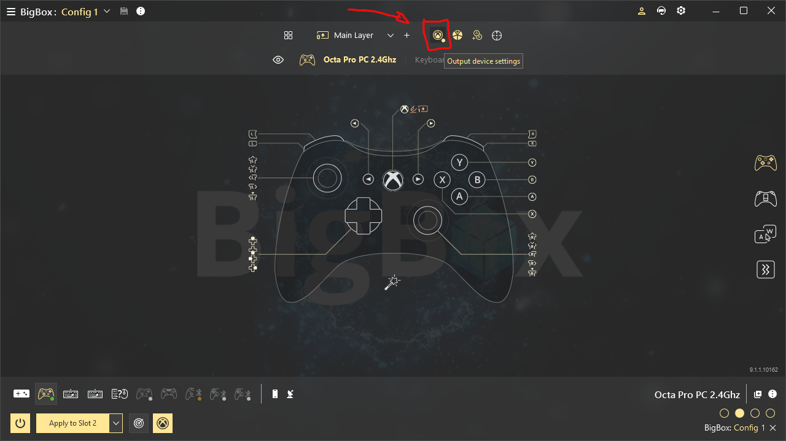

# BigBox Trans-Generational Emulation Station

## Table of Contents
- [Summary](#summary)
- [BigBox Trans-Generational Emulation Station](#bigbox-trans-generational-emulation-station)
  - [Overview](#overview)
    - [Key features](#key-features-include)
  - [Supported Systems and Resolutions](#supported-systems-and-resolutions)
    - [Note](#note)
  - [Why Build It?](#why-build-it)
  - [Challenges & Constraints](#challenges--constraints)
  - [Requirements and Software](#requirements-and-software)
    - [Hardware Requirements](#hardware-requirements)
    - [Software Requirements](#software-requirements)
      - [Essential Software](#essential-software)
      - [Optional Software](#optional-software)
      - [Additional Recommendations](#additional-recommendations)
  - [Video Signal Chain](#video-signal-chain)
  - [Setup Process](#setup-process)
    - [Preparing the PC](#preparing-the-pc)
    - [GPU and Driver Setup](#gpu-and-driver-setup)
      - [Important: AMD GPU + Scaler HDCP Fix](#important-amd-gpu--scaler-hdcp-fix)
    - [Windows Configuration](#windows-configuration)
  - [SSH for File Transfers (Essential for Gamepad-Only Operation)](#ssh-for-file-transfers-essential-for-gamepad-only-operation)
    - [Why Password-Free SSH?](#why-password-free-ssh)
    - [SSH Setup Steps](#ssh-setup-steps)
    - [Alternative](#alternative)
    - [Notes](#notes)
  - [Resolution and Emulator Configuration](#resolution-and-emulator-configuration)
    - [Resolution Setup with CRU](#resolution-setup-with-cru)
      - [Resolution Table](#resolution-table)
      - [Notes](#notes-1)
    - [CRU Setup Steps](#cru-setup-steps)
    - [Emulator Configuration](#emulator-configuration)
      - [RetroArch Configuration](#retroarch-configuration)
      - [Standalone Emulator Configuration](#standalone-emulator-configuration)
  - [Using Res-O-Matic for Custom Resolutions](#using-res-o-matic-for-custom-resolutions)
    - [STEAM](#steam)
  - [REWASD and LaunchBox Setup](#rewasd-and-launchbox-setup)
    - [REWASD Setup](#rewasd-setup)
    - [Proposed Controller Mapping Chart](#proposed-controller-mapping-chart)
    - [LaunchBox Configuration](#launchbox-configuration)
  - [Final Touches](#final-touches)
    - [Debloating Windows](#debloating-windows)
      - [O&O ShutUp10 Configuration](#oo-shutup10-configuration)
      - [Winaero Tweaker Configuration](#winaero-tweaker-configuration)
    - [Additional optional Optimizations](#additional-optional-optimizations)
      - [Notes](#notes-2)
  - [Conclusion](#conclusion)
  - [Links](#links)

## Summary
The BigBox Trans-Generational Emulation Station is a passion-driven project that unifies 40+ years of gaming history, from 1980s arcade classics to modern Switch and Steam titles, into a console-like experience on Windows 10. It outputs native resolutions (224p–720p) over HDMI to modern scalers for pixel-perfect visuals, uses LaunchBox/BigBox for a gamepad-only interface, and standardizes controls with REWASD. Key features include seamless gamepad navigation, CRT shaders via a RetroTink 4K scaler, and support for horizontal and vertical (TATE) arcade games. Built with a Ryzen 9 mini PC, RX 580 eGPU, and custom scripts, it overcomes challenges like Windows controller reordering and popup dismissal, offering a polished, couch-friendly emulation hub.

---

# BigBox Trans-Generational Emulation Station
Native Resolutions • Seamless Gamepad Control • Console-Like Experience for scalers on modern displays

Imagine launching Pac-Man in its original 224p arcade resolution, then switching to The Witcher 3 at 720; all from your couch, using only a gamepad… No keyboard, no fuss. This project is a passion-driven emulation hub that unifies 40+ years of gaming history, from 1980s arcade classics to modern Switch and Steam titles, in their original resolutions. It’s a console-like experience that prioritizes visual fidelity, ease of use, and minimum compromises.

## Overview
The idea is to create a unified emulation platform that preserves the authentic visual experience of retro gaming while providing modern convenience:
Instead of separate devices for different eras or accepting visual compromises, you get one system that handles everything from 1980s arcade cabinets to current-generation Switch games - all displaying at their original resolutions before being properly upscaled by dedicated hardware.
The key breakthrough is outputting true native resolutions (224p to 720p) over HDMI to modern scalers, something most PCs and emulation distributions can't achieve.
Combined with gamepad-only operation through BigBox and standardized controls via REWASD, the result feels like using a premium retro console rather than managing a collection of emulators on a computer.
The system aims at removing the usual drawbacks of PC emulation: no keyboard/mouse dependency, no resolution mismatches, no juggling between different interfaces.
You boot directly into a unified game library, select any title from four decades of gaming, and it launches at the correct resolution with consistent controls - exactly as these games were meant to be experienced, but on modern displays.

### Key features include:
- Pixel-Perfect Visuals: Every game runs at its native resolution, upscaled to a modern display with CRT shaders.
- Seamless Gamepad Control: Navigate menus and play games (tested with four controllers), standardized across all systems with consistent hotkeys (e.g., Home + Start to quit).
- Unified Frontend: LaunchBox/BigBox offers a polished, gamepad-only interface, integrating standalone emulators and Steam for a cohesive experience.
- Versatile Output: Supports both horizontal and vertical (TATE) arcade games, with flexible output to modern displays via HDMI.

The system is thought to output to any HDMI-compatible scaler, supporting up to 4K with a suitable monitor.
In my setup, I use a RetroTink 4K scaler to upscale all resolutions to 1080p (limited by my Eizo FG2421 monitor), applying CRT shaders for a crisp, scanline-rich image. Vertical arcade games are displayed in TATE mode by rotating the monitor on a VESA stand.

## Supported Systems and Resolutions
Native resolutions for each platform (4:3 and 16:9 depending on the system running).

| System | Native Resolution |
|--------|-------------------|
| NES, SNES, Megadrive | 224p–240p |
| Arcade (MAME, FBNeo) | 224p–384p |
| Nintendo DS | 256p (stacked) |
| PSP | 272p |
| Game Boy Advance* | 320p (doubled for modeline compatibility) |
| Sega Model 3 | 384p |
| Dreamcast, PS2, Wii | 480p–768p |
| PS Vita, Switch, Steam | 720p |

* Minimum resolution is 224p so I upscale Game Boy to 224p and GBA to 320p.

### Note:
This wide resolution support is made possible thanks to CRU’s ability to add custom modelines and Adrenalin 22.5.1—the last AMD driver that supports true 240p output while maintaining Vulkan compatibility.
To my knowledge, the RX 580 is the most powerful GPU that still meets these requirements.
Since my host system is a mini PC with a 780M iGPU, I added an eGPU dock via OCuLink to run the RX 580 externally.


## Why Build It?
This idea first came when I noticed how better my RetroTink was when fed with original resolution from my physical consoles vs upscaled signals from PC or Batocera systems.
Existing emulation solutions often fall short of this unified vision:
- MiSTer/FPGA: Excellent for cycle-accurate 240p retro systems (up to PS1) but lacks support for more modern.
- Batocera/RetroPie: User-friendly but typically upscale retro games, losing native resolution fidelity, and struggles with flexible HDMI output.
- CRT EmuDriver: Powerful for 240p on older GPUs but outdated, unsigned, and incompatible with modern APIs like Vulkan or Steam.
- Standalone Systems: Most PCs or consoles can’t output native 224p–720p over HDMI without external scalers or complex tweaks.
This project means to overcome these limitations, offering a flexible, gamepad-driven platform that supports native resolutions across generations, integrates standalone emulators and Steam, and outputs to modern displays via HDMI.

## Challenges & Constraints
Building a unified, gamepad-only emulation system came with a few key challenges. I spent a full month configuring the setup and invested in several hardware components I didn’t already own.
Most notably, Windows lacks native support for consistent controller order, requiring a custom Bluetooth toggle workaround. Achieving true native resolutions also meant manually defining custom timings with CRU, and carefully selecting hardware (like the RX 580 with Adrenalin 22.5.1) to support both 240p output and modern Vulkan-based emulators. All this in order to preserve resolution accuracy, controller consistency, and the seamless couch-only experience.

## Requirements and Software
### Hardware Requirements
The system requires a PC with sufficient power for emulation, a GPU supporting low-resolution timings, an HDMI scaler and monitor. My tested setup is only provided as an example.

- PC: A powerful enough multi-threaded CPU (e.g., 8 cores) and at least 16GB RAM to handle PS3, Switch, and Steam emulation. Tested with: GMKtec NucBox K11 with Ryzen 9 8945HS, 32GB DDR5.
- GPU: A graphics card supporting 240p–720p native resolutions over HDMI and Vulkan for modern emulators. Tested: RX 580 via OCuLink eGPU, the highest-performing GPU with 240p support.
- Scaler/Display: An HDMI scaler accepting 224p–720p inputs, ideally upscaling to 1080p or 4K with CRT shader support. Tested: RetroTink 4K scaler outputting to an Eizo FG2421 1080p monitor on a VESA stand for TATE mode.
- Controllers: Gamepads (wired or wireless). Tested: Sony DualSense x2, Hori Octa Pro, Xbox Series X controller (four players).

## Software Requirements
(links at the end of the post)
Some paid and free components are used. Essential software is required for core functionality, while optional tools simplify setup or enhance performance.

### Essential Software
| Software | Type | Purpose |
|----------|------|---------|
| Windows 10 Pro | Paid | OS |
| LaunchBox/BigBox | Paid | Gamepad-driven frontend for unified emulator and Steam integration. |
| REWASD | Paid | Standardizes controller inputs across all systems and emulators. |
| Custom Resolution Utility (CRU) | Free | Defines native resolutions (224p–720p) for retro systems. |
| Adrenalin 22.5.1 | Free | AMD driver supporting 240p timings and Vulkan (for compatible GPUs). |
| RetroArch | Free |  |
| Standalone Emulators | Free | For programs better than RA or where libretro core is not available. |
| Steam | In-Pay | Or similar client. |
| AutoHotkey 1.1 | Free | Scripts for unified hotkeys and popup dismissal. |
| Res-O-Matic | Free | Forces specific resolutions for emulators. |
| Visual C++, .NET Framework, DirectX | Free | Runtime libraries for emulator compatibility. |

### Optional Software
- Microsoft Show/Hide Updates: Prevents unwanted AMD driver updates that break 240p support.
- 7Zip: Manages emulator and ROM archives. (or any other archive manager)
- Proprietary Controller Drivers: Possibly required for some windows gamepads (It is the case with my Hori Octa Pro).
- WinSCP: Simplifies ROM transfers over a network (requires SSH setup on the PC).
- Debloating Tools (O&O ShutUp10, Winaero Tweaker): Optimize Windows by disabling telemetry and lockscreen.
- Notepad++: Enhances scripting for AutoHotkey and batch files.
- AMD Clean-Up Utility, DDU: Ensures clean GPU driver uninstallation.
- Vulkan SDK: Improves compatibility for emulators like RPCS3.
- Revo Uninstaller, CCleaner: Manages startup apps and removes unnecessary software.

### Additional Recommendations
- Secondary PC: Useful for setup tasks like ROM transfers or scripting, but not required.
- Network Setup: Enabling SSH on the emulation PC (e.g., via OpenSSH Server) allows file transfers without USB drives. USB or NAS work too but SSH is best with a Gamepad only machine.
- Clean Windows Install: Install Windows without internet to avoid automatic driver updates, then use the Show/Hide Updates tool to block AMD driver changes.

## Video Signal Chain
The system outputs native resolutions (224p–720p) via HDMI, upscaled by a scaler to a modern display. Below is the signal flow for my setup, adaptable to other GPUs, scalers, or monitors.
[PC: RX580 GPU] --> [HDMI: 224p–720p] --> [RT4K Scaler: Upscales to 1080p/4K] --> [FG2421 Display: 1080p]

In my configuration:
- The mini PC (Ryzen 9 8945HS) and RX 580 eGPU generate native resolutions.
- The RetroTink 4K scaler upscales to 1080p, applying CRT shaders for retro authenticity.
- The Eizo FG2421 displays at 1080p, limited by its resolution, but a 4K monitor could replace it for higher output.

## Setup Process
Setting up the emulation station involves preparing the PC, configuring the GPU and drivers, optimizing Windows, and enabling file transfers.

### Preparing the PC
1. Gather Files: Collect all required software (emulators, drivers, utilities) on a network drive or USB stick for easy access.
2. BIOS Settings: Enter the BIOS and set the CPU to performance mode to maximize emulation power. Disable unnecessary features like secure boot if they interfere with drivers.
3. Windows Installation:
   - Install Windows 10 Pro without setting internet yet.
   - Skip setting a password to enable auto-login, critical for gamepad-only operation (see SSH section below).

### GPU and Driver Setup
A compatible GPU is essential for outputting native resolutions (224p–720p) and supporting modern emulators. These steps are based on my RX 580 with Adrenalin 22.5.1 drivers, but other GPUs supporting low-resolution timings and Vulkan can work. The CRT Emudriver page lists the compatible GPUs: https://geedorah.com/eiusdemmodi/forum/viewtopic.php?id=295

1. Install Drivers:
   - Download Adrenalin 22.5.1 from AMD website. (Link at the bottom of this post)
   - Install with factory reset enabled. If reinstalling, use AMD Clean-Up Utility plus Display Driver Uninstaller (DDU) in Safe Mode to clean old drivers.
   - Disable automatic updates in Adrenalin settings to prevent 240p-incompatible updates.
2. Block Driver Updates:
   - Install network drivers after setup and connect to the internet.
   - Immediately run Microsoft’s Show/Hide Updates tool (wushowhide.diagcab).
   - Hide any AMD display driver updates.

### Important: AMD GPU + Scaler HDCP Fix
When using an AMD GPU with an HDMI scaler (e.g., RetroTink 4K, OSSC), you will likely encounter a blurred or pixelated display due to DRM issues. Here is the fix:
1. Setup Dual HDMI Connections:
   - Temporarily connect a second HDMI cable directly from the GPU to the monitor (assuming it has multiple HDMI inputs).
2. Configure Display Settings:
   - Right-click on the desktop, go to Display Settings, and set the direct GPU-to-monitor connection as the main display.
   - Choose “Duplicate” mode (not “Extend”) to mirror the desktop, temporarily unblurring the scaler output.
3. Disable HDCP:
   - Open Adrenalin, click the gear icon (Settings), then select Display.
   - Scroll to Overrides, accept the warning, and uncheck HDCP Support to disable it.
4. Finalize:
   - Remove the second HDMI cable, leaving only the GPU → scaler → monitor connection.
   - The display should now be clear, with native resolutions output correctly to the scaler. If not, memorize the position of Adrenalin interface and find overrides /HDCP again with a pixelated screen… And turn it OFF!

### Windows Configuration
1. Activate Windows
2. Maximize CPU Performance:
   - Run msconfig in the Windows search bar, go to Boot → Advanced Options, and set Number of Processors to the maximum (e.g., 16 for an 8-core CPU).
3. Power Settings:
   - Go to Settings (win+X) → Power and Sleep, disable screen sleep, and set performance to Best Performance.
   - Disable screensaver to prevent being stuck with your gamepad.
4. Remove Bloat: In Settings → Apps and Optional Features, uninstall unnecessary apps
5. Game Bar Settings → Untick Allow your controller to open Game Bar.
6. Install Runtimes:
   - Install Visual C++, .NET Framework, DirectX, and Vulkan SDK.
7. Update Windows:
   - Run Windows Update, install all updates, and reboot until no updates remain. (AMD Display driver should not show since they’ve previously been hidden).
8. Set Your desired Desktop Resolution (I am using 1280 x 720)

## SSH for File Transfers (Essential for Gamepad-Only Operation)
A core goal of this setup is to boot directly into BigBox with no keyboard or mouse interaction. However, adding a Windows password breaks automatic login and forces keyboard input at startup—violating the gamepad-only design. Standard USB transfers aren't practical either, as they require launching Explorer via Task Manager and connection keyboard and mouse.
The solution is to enable password-free SSH, which allows file transfers from another PC (e.g., via WinSCP) while preserving seamless, controller-only operation.

### Why Password-Free SSH?
- Preserves Gamepad-Only Boot: A Windows password halts boot at login and requires a keyboard—breaking the shell experience.
- Avoids USB Transfer Hassle: Without Explorer access, USB file transfers require Ctrl+Alt+Del and keyboard navigation.
- Seamless Network Transfers: SSH allows full file access from another PC without touching the emulation system.
- Safe in Context: This setup is for a locked-down, dedicated emulation box with no sensitive data and isolated on a home network.

### SSH Setup Steps:
1. Enable OpenSSH Server:
   - Open PowerShell as admin and run:
     ```
     Add-WindowsCapability -Online -Name OpenSSH.Server~~~~0.0.1.0
     ```
   - Verify installation:
     ```
     Get-WindowsCapability -Online -Name OpenSSH.Server~~~~0.0.1.0
     ```
2. Configure SSH Service:
   - Run `services.msc`, find OpenSSH SSH Server, set Startup Type to Automatic, and click Start.
3. Allow Blank Passwords:
   - Run `secpol.msc`, navigate to Security Settings → Local Policies → Security Options.
   - Set “Accounts: Limit local account use of blank passwords to console logon only” to Disabled.
4. Edit SSH Config:
   - Open `C:\ProgramData\ssh\sshd_config` in Notepad++.
   - Find, uncomment and modify:
     ```
     # PasswordAuthentication yes
     # PermitEmptyPasswords no
     ```
     to:
     ```
     PasswordAuthentication yes
     PermitEmptyPasswords yes
     ```
   - Save and close.
5. Get IP Address:
   - Run `ipconfig` in CMD to note the emulation PC’s IP address.
6. Set Up WinSCP on Another PC:
   - Install WinSCP on the other computer, add a new connection with the emulation PC’s IP, port 22, and blank password (protocol: SFTP).
   - Connect to transfer files seamlessly.

### Alternative:
Use USB drives for file transfers, only recommended if SSH is not feasible.

### Notes
- Driver Caution: Always block AMD /Adrenalin driver updates to preserve 240p compatibility.
- SSH Security: Password-free SSH is designed for isolated emulation PCs. If your PC stores sensitive data, consider a password and accept the keyboard input trade-off.

# Resolution and Emulator Configuration
This section covers setting up native resolutions (224p–720p) using Custom Resolution Utility (CRU) and configuring emulators to output them correctly, targeting pixel-perfect visuals.

## Resolution Setup with CRU
Here are the resolutions and timings used in my setup, which you can adapt to your scaler or display.

### Resolution Table
| Resolution | Active (H×V) | Front Porch (H/V) | Sync Width (H/V) | Blanking (H/V) | Polarity (H/V) | Refresh Rate (MHz) |
|------------|--------------|-------------------|------------------|----------------|----------------|--------------------|
| 224p       | 2560×224     | 16/3              | 32/4             | 80/14          | -/-            | 59.985             |
| 240p       | 2560×240     | 16/3              | 32/4             | 80/15          | -/-            | 60.011             |
| 256p       | 2560×256     | 16/3              | 32/4             | 80/16          | -/-            | 59.840             |
| 272p       | 2560×272     | 16/3              | 32/4             | 80/17          | -/-            | 60.003             |
| 320p       | 2560×320     | 16/4              | 32/5             | 80/20          | -/-            | 60.004             |
| 384p       | 2560×384     | 16/5              | 32/6             | 80/24          | -/-            | 60.002             |

### Notes:
- Why These Timings?
  Slight variations in refresh rates (e.g., 59.985 vs. 60.000 Hz) helped prevent RetroArch’s CRT SwitchRes from choosing the wrong resolution (like 224p instead of 240p). Your setup might not need this adjustment, but in my case, it made resolution switching more reliable, so I do not recommend setting 60.000Hz everywhere.
- My Setup: I output PSP, Vita and 480p /480i systems at 720p (desktop resolution) because my RetroTink 4K handles 720p better than 272p or 480p when upscaling to 1080p. Other scalers or 4K displays may perform better at native 272p/480.
- Horizontal Timings: All resolutions use the same horizontal settings (Active: 2560, Front Porch: 16, Sync Width: 32, Blanking: 80, Polarity: -).


## CRU Setup Steps
1. Open CRU: Launch CRU and ensure your scaler/display is selected (top left, marked “active”). If not, choose it from the dropdown.
2. Clear Defaults: In Detailed Resolutions (top right), delete existing resolutions to make space for yours.
3. Add Resolutions:
   - Click Add, select Manual timing, and enter settings from the table above (e.g., 2560×224 for 224p).
   - For 224p–256p, add under Detailed Resolutions (up to three slots).
   - For 272p–384p, go to Extension Blocks → CTA-861 → Edit, and add them there.
4. Save and Restart:
   - Click OK twice to save changes.
   - Run restart64.exe (in the CRU folder) to apply the new resolutions.
5. To Verify: You can test each resolution in Retroarch when CRT SwitchRes 15Khz is active (Settings > Video > CRT Switchres > 15Khz / 2560)

## Emulator Configuration
The goal is to preserve each system’s original signal and let the scaler handle all upscaling and CRT-style processing. Emulators should output native resolutions wherever possible, with no internal filtering or smoothing.
Use nearest-neighbor scaling and x1 resolution for anything up to the PS1 era to maintain pixel accuracy. For PS2 and newer systems, internal resolution scaling (x2 or x3) can be used selectively when it looks better.
RetroArch is used for most retro systems, while standalone emulators are preferred for newer platforms. When RetroArch’s CRT SwitchRes isn't suitable (e.g., for vertically stacked DS or 480p+ content), Res-O-Matic is used to launch games at the desired resolution.

### RetroArch Configuration
1. General Settings:
   - Go to Settings → User Interface → Menu, select rgui.
     This might not be the sexiest skin, but it works best with low resolutions.
   - For each core, load a game, open the menu, and set:
     - Video → Scaling → Aspect Ratio: Core Provided (or Full for vertical games if stretched).
     - Save core overrides: Quick Menu → Overrides → Save Core Overrides.
2. Note on Ratio:
   “Core Provided” usually works, but if a game looks stretched—especially vertical ones—switch to “Full.” This is safe because the RetroTink 4K enforces 4:3 output, so nothing gets stretched to 16:9. It also smartly adapts when 16:9 content (like Vita or desktop) is detected.
3. PS1 (Mednafen PSX Core):
   - Menu → Settings → Video → CRT SwitchRes: Enable, set to 15kHz, 2560 horizontal.
   - Aspect Ratio: Core Provided.
   - Save core overrides.


4. Arcade (FBNeo Core):
   - Same as PS1, plus Quick Menu → Core Options → Vertical Mode: TATE or TATE Alternate (Will only affect vertical games).
   - Aspect Ratio: Core Provided (or Full if stretched).
   - Save core overrides. If a game needs aspect ratio Full, save as game override.
5. Nintendo DS (Desmume Core):
   - CRT SwitchRes: Disable (desired 2560×256 is not properly detected by SwitchRes).
   - Aspect Ratio: Full.
   - Core Options → Screen Layout: Bottom/Top (or Top/Bottom per preference).
   - Save core overrides.
   - Use Res-O-Matic in LaunchBox (see below) to force 2560×256.
6. GameCube (Dolphin Core), Dreamcast (Flycast Core):
   - CRT SwitchRes: Disable (RetroArch defaults to desktop resolution).
   - Aspect Ratio: Core Provided (enforce 4:3 in LaunchBox with Res-O-Matic).
   - Use Res-O-Matic to force 1024×768 (720p) or 640×480 (480p) in LaunchBox.
   Note: My RetroTink 4K struggles with 480p scanlines when scaled at 1080p, so I use 720p for GameCube/Dreamcast. If your scaler handles 480p well, use native 480p.

### Standalone Emulator Configuration
Standalone emulators handle modern systems (PS2, Switch, etc.) and some retro systems. Set them to native resolutions or 720p, depending on your scaler’s performance.
1. MAME 0.272 (Namco, ST-V, SNK Hyper 64):
   - For ST-V (224p):
     - Run a game in Mame.
     - Create /MAME/ini/stvbios.ini, containing:
       ```
       [stvbios]
       resolution        2560x224@60
       aspect            4:3
       rotate            0
       unevenstretch     1
       switchres         1
       ```
     - For vertical games (e.g., Shienryu), create /MAME/shienryu.ini, containing:
       ```
       rotate            1
       ```
     - Launch the game, if needed, adjust rotation, save Game settings (Not System settings).
   - Namco/SNK: Run at 720p (desktop resolution) automatically which is fine by me but you can repeat the ST-V process with resolution 640x480@60 if desired.
2. Supermodel (Sega Model 3):
   - Get the Supermodel.ini (likely for Xinput) and NVRAM files from the great thread of Warped Polygon https://forums.launchbox-app.com/files/file/3857-sega-model-3-supermodel-git-everything-pre-configured-inc-controls-for-pc-controller-mouse-light-guns-test-menus-configured-free-play-all-games-in-english-2-player-mouse-support-audio-adjusted-layout-imagesthe-whole-9-yards/
   - Follow additional setup from Warped Polygon’s guide (But no GUI needed to preserve 384p).
   - Edit /supermodel/Config/Supermodel.ini:
     ```
     FullScreen=1
     Throttle=1
     XResolution=2560
     YResolution=384
     Stretch=True
     ```
3. Citra (3DS):
   - Set View → Screen → Rotate Up Right for vertical stacked screens.
   - Run at 720p (desktop resolution) or use ResOMatic in LB for customs resolution.
4. PCSX2 (PS2), RPCS3 (PS3), Ryujinx (Switch), Vita3K (PS Vita):
   - RPCS3 version:
     0.0.27-14837 for most games (best compatibility with AMD 22.5.1)
     0.0.32-16657 for games not working properly on 0.0.27. (some graphical options are not available on older versions)
   - PCSX2 version:
     1.7.4886 for most games (best compatibility with AMD 22.5.1 drivers)
     Newest version for any game not working well on 1.7, but can’t use Vulkan.
   - Set to native resolutions (480p–720p) or 720p (desktop).
   - For PS2, use internal resolution x2/x3 for sharper graphics; for older systems, use x1 and Nearest Neighbor to preserve raw pixels.
   - PCSX2 respects 4:3 natively; PS3/Switch/Vita use 16:9.
5. PPSSPP (PSP):
   - Set to 272p (native) or 720p (desktop) based on scaler performance.

# Using Res-O-Matic for Custom Resolutions
Res-O-Matic forces specific resolutions when RetroArch’s CRT SwitchRes isn’t used (e.g., DS, GameCube). We will create bat files in the emulators’ folders and configure these alternative emulators in LaunchBox.

- Example: Nintendo DS (2560×256):
  - Create C:/RetroArch/launch_retroarch_ds_256x2560.bat, containing:
    ```
    @echo off
    echo start /wait "" "C:\Emulators\RetroArch\retroarch.exe" -L "cores\desmume_libretro.dll" %* > "%TEMP%\launch_ds.bat"
    start /wait "" "C:\resUtilities\reso.exe" "%TEMP%\launch_ds.bat" 2560 256 32 60
    del "%TEMP%\launch_ds.bat"
    ```
  - In LaunchBox, add as a new emulator (e.g., “RetroArch DS 256p”), target Application path = launch_retroarch_ds_256x2560.bat and associate with Nintendo DS.


- Example: GameCube (1024×768):
  - Create /RetroArch/launch_retroarch_dolphin_1024x768.bat, containing:
    ```
    @echo off
    echo start /wait "" "C:\Emulators\RetroArch\retroarch.exe" -L "cores\dolphin_libretro.dll" %* > "%TEMP%\launch_dl.bat"
    start /wait "" "C:\resUtilities\reso.exe" "%TEMP%\launch_dl.bat" 1024 768 32 60
    del "%TEMP%\launch_dl.bat"
    ```
  - Add as a new emulator in LaunchBox for GameCube.

Tip: Adjust paths and core names to match your setup. Create similar scripts for other systems needing custom resolutions.
Note: check the core spelling going to /RetroArch/Cores/ directory

## STEAM
Upon installing Steam and connecting to your account, go to:
Steam/ Settings/ Controller => Guide Button Focuses Steam = OFF
And Enable Guide Button Chord for Controller = OFF
Also, it is up to you, but if you want the games to install on the emulation PC locally and be available without network, better go to Steam/ Settings/ Remote Play/ and turn it OFF. (Otherwise, if your main PC is connected, games might not install locally and rather use the install from the other computer and trigger the mirror screen on both machines).

## REWASD and LaunchBox Setup
This section configures REWASD to standardize gamepad inputs across all emulators and LaunchBox/BigBox to unify emulators, Steam, and scripts for a seamless, gamepad-only experience.
My setup uses a mix of two Sony DualSense, Hori Octa Pro, and an Xbox Series X controller, but any wired or wireless gamepads work.

### REWASD Setup
Connect all your controllers and start REWASD.

- Profile Creation:
  - Delete default profiles if you don’t need them and create a new one (e.g., “BigBox”).
  - Select a gamepad from the bottom icons (e.g., DualSense).
- Set Output to Virtual Xbox:
  - Click the Xbox icon (top center, “Output Devices Settings”).
  - Enable Virtual Xbox 360 (or XInput /SDL of your choice) on the left and save.



- Configure Hotkeys:
  - Click the Home button (e.g., PS or Xbox button) on the gamepad schematic.
  - Select Shift Mode → Jump to Layer 1.
  - Switch to Shift Layer 1 (top center) and map:
    - South (X on PlayStation, A on Xbox) = TAB (opens emulator menus).
    - Start = ESC (quits emulators).
    - Or your preferred keys.
  - Save the profile.
- Apply to All Gamepads:
  - Select each gamepad and click Apply to Slot 1, Slot 2, etc.
  - Ensure REWASD starts with Windows (Settings (top right, gear icon) → General → Start with Windows).
  - Additionally, while in REWASD settings, you can tweak → Overlay → and there deactivate unwanted notifications.
- Test in Emulators:
  - Open RetroArch and every standalone emulator to verify controls work. If needed, rebind in emulator settings, selecting Xinput or SDL as the input type.

### Proposed Controller Mapping Chart
To ensure consistent controls across all emulators and BigBox:

| Button Combo | Action | Purpose |
|--------------|--------|---------|
| Home + South | TAB    | Opens emulator configuration menus. |
| Home + Start | ESC    | Quits the emulator or game. |
| Standard Buttons | Native | Mapped to in-game controls (configured per emulator). |

Note: You can customize these combos in REWASD (e.g., Home + Select = TAB).
Ensure all emulators are set to respond to TAB (menu) and ESC (quit), or use LaunchBox scripts for those that don’t support remapping.

### LaunchBox Configuration
I am not doing a Launchbox tutorial here and will only focus on the steps useful for unified quitting, custom resolutions, popup dismissal, and controller reordering.

- Install LaunchBox/BigBox:
  - Download and install LaunchBox with BigBox for gamepad-only navigation.
  - Import ROMs and configure emulators (cf. LaunchBox documentation).
- Unified Quit Control:
  - For emulators supporting custom quit keys (e.g., PPSSPP):
    - Set ESC as the quit key in emulator settings.
    - Disable “Confirm Quit” to ensure instant closure.
  - For emulators without custom quit keys (e.g., RPCS3):
    - In LaunchBox, go to Tools → Manage → Emulators → RPCS3 → Edit → Running Script.
    - Add:
      ```
      $Esc::
      {
          WinClose, ahk_exe rpcs3.exe
          Sleep 100
          If WinExist("ahk_exe rpcs3.exe")
              Process, Close, rpcs3.exe
      }
      Return
      ```
    - Repeat for other emulators (replace rpcs3.exe with the emulator’s executable).


- Custom Resolutions with Res-O-Matic:
  - For RetroArch cores needing specific resolutions (e.g., Nintendo DS at 2560×256, GameCube at 640 x 480 or 1024×768):
    - Create a batch file in the RetroArch folder (e.g., launch_retroarch_ds_256x2560.bat) containing:
      ```
      @echo off
      echo start /wait "" "C:\Emulators\RetroArch\retroarch.exe" -L "cores\desmume_libretro.dll" %* > "%TEMP%\launch_ds.bat"
      start /wait "" "C:\resUtilities\reso.exe" "%TEMP%\launch_ds.bat" 2560 256 32 60
      del "%TEMP%\launch_ds.bat"
      ```
    - Add as a new emulator in LaunchBox:
    - Tools → Manage → Emulators → Add.
    - Name: “RetroArch DS 256p”.
    - Application Path: Select the batch file we just created (launch_retroarch_ds_256x2560.bat).
    - Associate with Nintendo DS platform.
    - Repeat for GameCube (640 x 480 or 1024×768, dolphin_libretro.dll) or other systems.
  - Adjust paths and core names to match your setup. Core names are available in /Retroarch/Cores/

- Dismissing Popups:
  - For games with popups (e.g., Steam’s Forza Horizon 5 giving me a GPU obsolete driver warning):
    - Create ROMs/Steam/LaunchForza.bat, containing:
      ```
      @echo off
      start "" "ForzaPopupKiller.ahk"
      ```
    - Create ForzaPopupKiller.ahk in the same folder:
      ```
      #SingleInstance Force
      SetTitleMatchMode, 2
      Run, steam://rungameid/1551360
      Sleep, 10000
      timeout := 90000
      elapsed := 0
      interval := 500
      Loop
      {
          IfWinExist, Forza Horizon ahk_class #32770
          {
              WinActivate
              Sleep, 300
              SendInput {Alt down}
              SendInput {F4 down}
              Sleep, 50
              SendInput {F4 up}
              SendInput {Alt up}
              Sleep, 1000
              IfWinExist, Forza Horizon ahk_class #32770
              {
                  WinGetPos, X, Y, W, H, Forza Horizon ahk_class #32770
                  XButtonX := X + W - 20
                  XButtonY := Y + 20
                  Click, %XButtonX%, %XButtonY%
                  Sleep, 500
                  IfWinExist, Forza Horizon ahk_class #32770
                  {
                      WinKill
                  }
              }
              break
          }
          Sleep, %interval%
          elapsed += interval
          if (elapsed >= timeout)
              break
      }
      ```
    - In LaunchBox, edit Forza Horizon 5 (Right click → Edit Metadata → Launching → Application Path) and select LaunchForza.bat.
    - For other popups, adjust the script (use WindowSpy.ahk to find the window class/title, it is in the AutoHotKey install directory).
- Controller Reordering Workaround:
  - Windows lacks native controller reordering, so we will use a Bluetooth toggle script to reorder gamepads without keyboard/mouse.
  - Create C:/Emulators/Bluetooth/ToggleBluetooth.bat, containing:
    ```
    @echo off
    net session >nul 2>&1
    if %errorlevel% neq 0 (
        powershell -Command "Start-Process cmd -ArgumentList '/c %~f0' -Verb RunAs" >nul 2>&1
        exit
    )
    start /min powershell -NoProfile -ExecutionPolicy Bypass -Command "$ProgressPreference = 'SilentlyContinue'; $bt = Get-PnpDevice -FriendlyName '*Bluetooth*' | Where-Object {$_.HardwareID -like '*BTH\MS_BTHBRB*'}; $bt | Disable-PnpDevice -Confirm:$false; Start-Sleep -Milliseconds 500; $bt | Enable-PnpDevice -Confirm:$false; Start-Sleep -Milliseconds 500" >nul 2>&1
    exit
    ```
  - Create an empty file as: C:/Emulators/Bluetooth/BT.bin
  - In LaunchBox:
    - Create a new platform (eg. BT-Toggle).
    - Add a new emulator: Tools → Manage → Emulators → Add.
    - Name: “Gamepad Reorder”.
    - Application Path: ToggleBluetooth.bat.
    - Platform: “BT-Toggle”.
    - Add a ROM: Platform “BT-Toggle”, file BT.bin.
  - In BigBox, launch the “BT-Toggle” fake rom to toggle Bluetooth, then reconnect controllers in desired order (Player 1 first, Player 2 second, etc.).
  - Enhance visuals: In LaunchBox, filter by platform, find BT-Toggle and right click on it: edit metadata, and add images (e.g., Bluetooth logo, gamepads) as banner / clear logo override / device / fanart. Whatever works best with your BB theme.


### Notes
- BigBox Shell Mode: Once configured, set BigBox to launch at startup or even to run as shell (replacing Windows Explorer) for a true console-like experience. Don’t make BB a shell until you’re done setting up everything though.
- Script Paths: Adjust file paths in scripts to match your directory structure. My example was targeting a Window named Forza Horizon 5. When targeting a different popup, adjust the key words.
- Popup Workarounds: Test popup scripts with WindowSpy.ahk if the window class differs.

# Final Touches
With emulators, resolutions, and gamepad controls configured, the final step is to optimize Windows for maximum performance and a distraction-free, gamepad-only experience as close as possible to a gaming console.

## Debloating Windows
Debloating disables non-essential Windows features like telemetry and notifications, freeing resources for emulation and preventing popups that require keyboard/mouse input. Tools like O&O ShutUp10 and Winaero Tweaker simplify this process.
- Install Debloating Tools:
  - We will use O&O ShutUp10 and Winaero Tweaker, run as administrator.
- O&O ShutUp10 Configuration:
  - Launch O&O ShutUp10 and select “Recommended Settings” for a balanced approach, or customize:
    - Disable telemetry (under Privacy → Telemetry) to stop background data exchanges with Microsoft.
    - Turn off Windows Update notifications to prevent driver update prompts.
    - Disable Cortana and other background apps to reduce CPU usage.
  - Apply changes and reboot.
- Winaero Tweaker Configuration:
  - Open Winaero Tweaker and navigate to key settings:
    - Disable lockscreen (use the search bar if needed) as we can’t return in BigBox from Lockscreen with only a game controller.
    - Disable Action Center: Eliminates popups during gameplay.
    - Disable SmartScreen: Speeds up app launches (safe for a dedicated emulation PC).
  - Apply changes and reboot.

## Additional optional Optimizations
These tweaks polish the system, ensuring it boots directly into BigBox and runs efficiently.
- Disable Startup Apps:
  - Open Task Manager (Ctrl+Shift+Esc) → Startup tab.
  - Disable all non-essential apps (e.g., OneDrive, browser updaters), keeping REWASD and LaunchBox if set to auto-start.
- Set BigBox as Shell:
  - In BigBox, go to Options → General → Enable using as the Windows Shell. (replaces Explorer, no Dekstop).
  - If you do not want to use BigBox as shell, you can hide the icons on desktop (Right click, view, uncheck Show desktop icons)
- Optimize Storage:
  - Use CCleaner (optionally previously installed) to clear temporary files and cache. It also features a tool to manage startup apps.
  - Put ROMs and games to a fast SSD for quicker load times.
- Backup Configuration:
  - Back up LaunchBox settings (Tools → Backup) and REWASD profiles to a USB drive or network folder.
  - Save CRU settings and emulator configs for easy restoration.

### Notes
- Security Context: Disabling features like telemetry or SmartScreen is safe for a dedicated emulation PC with no sensitive data, isolated on a home network.

# Conclusion
We’re done! This project was about more than just running games but rather unifying different generations of hardware and software into a consistent, console-like experience. It’s the result of many small choices and workarounds coming together, and I hope it might be useful to others facing similar challenges.

# Links
- [CRU (Custom Resolution Utility)](https://customresolutionutility.net)
- [Adrenalin 22.5.1](https://www.amd.com/en/support/downloads/previous-drivers.html/graphics/radeon-600-500-400/radeon-rx-500-series/radeon-rx-580.html)
- [Visual C++](https://aka.ms/vs/17/release/vc_redist.x64.exe)
- [Net Framework Runtime](https://dotnet.microsoft.com/en-us/download/dotnet-framework/net481)
- [AutoHotkey 1.1](https://www.autohotkey.com/)
- [Microsoft Tool Show or Hide Updates](https://download.microsoft.com/download/f/2/2/f22d5fdb-59cd-4275-8c95-1be17bf70b21/wushowhide.diagcab)
- [AMD Clean-Up Utility](https://www.amd.com/en/resources/support-articles/faqs/GPU-601.html)
- [Vulkansdk](https://vulkan.lunarg.com/sdk/home#windows)